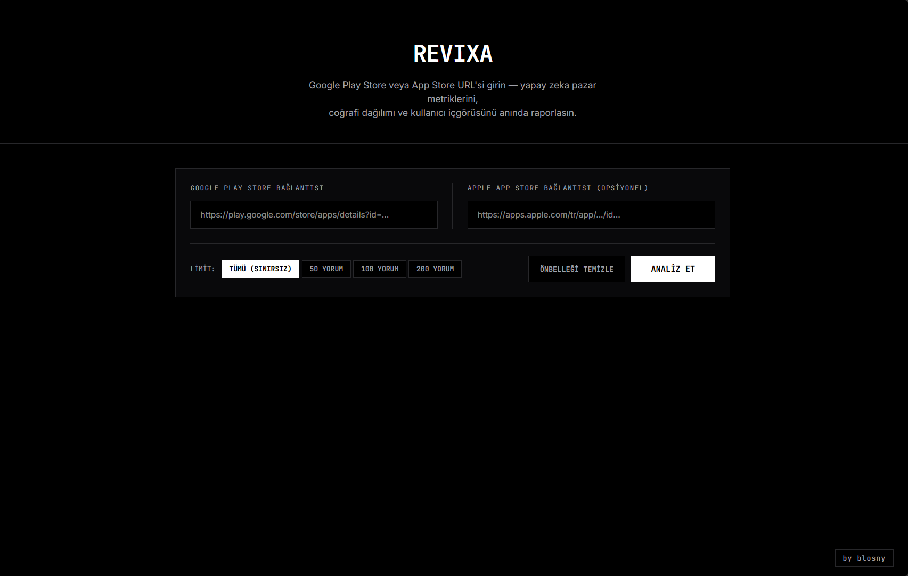
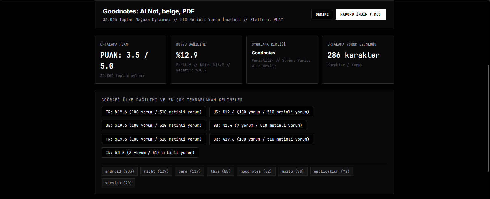
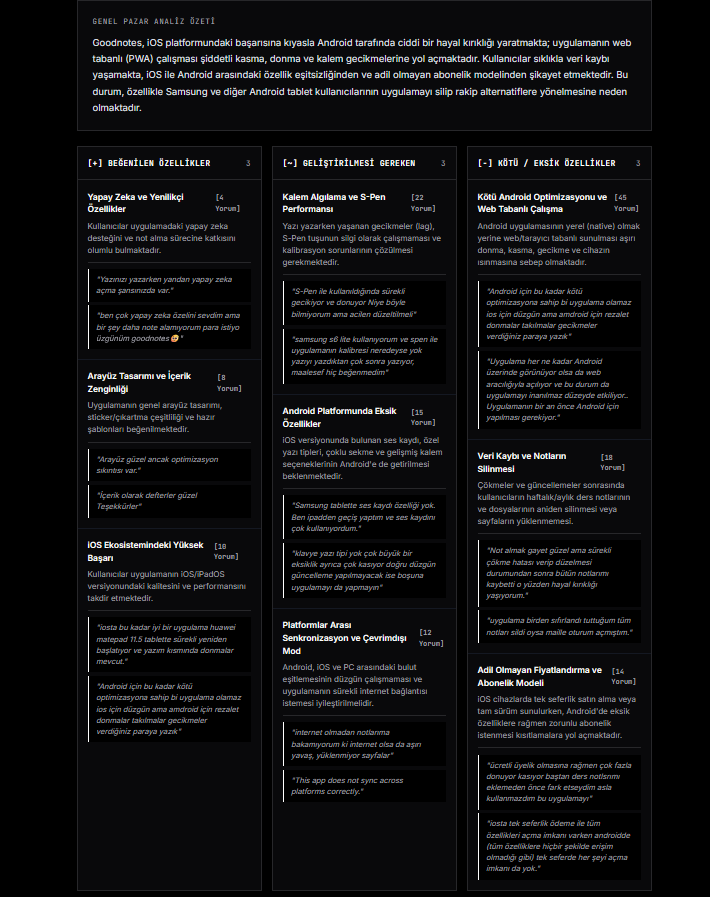

# REVIXA — Minimalist Mobile Market Intelligence

REVIXA is an automated market research and sentiment analysis engine designed to extract, analyze, and structure user feedback from Google Play Store and Apple App Store.

It utilizes an AI Router mechanism combining Google Gemini Flash with local Ollama fallback to categorize user sentiment, geographic telemetry, rating distributions, and product feature requests without service interruption.

---

## Interface Showcase

### 1. Minimalist Input Interface


### 2. Market Metrics & Geographic Telemetry


### 3. AI Categorized User Insights & Real Quotes


---

## Purpose

The primary goal of REVIXA is to provide developers, product managers, and market researchers with instant, actionable product insights derived directly from end-user reviews across global application stores.

---

## Core Capabilities

- Multi-Store & Dual Link Support: Simultaneously ingests user reviews from Google Play Store and Apple App Store.
- Geographic Telemetry: Tracks country distribution percentages across international markets (TR, US, DE, GB, FR, BR, IN).
- AI Fallback Router: Primary analysis executed via Gemini Flash; automatically switches to local Ollama (Llama 3.2) if rate limits occur.
- Market Metrics: Computes average review character lengths, star rating distributions, and keyword frequency tags.
- Enriched Market Insights: Calculates churn risk percentages, update warning flags, competitor mentions, and feature request rankings.
- Structured Export: Download timestamped Markdown (.md) reports.
- Minimalist Interface: Zero-clutter, monochrome user interface with custom segmented controls and database cache controls.

---

## Architecture & File Structure

```
revixa/
├── backend/
│   ├── main.py          # FastAPI application & REST endpoints
│   ├── analyzer.py      # AI Router (Gemini -> Ollama) & report generator
│   ├── scraper.py       # Multi-country review & metadata extraction engine
│   ├── cache.py         # SQLite caching engine with 1-hour TTL
│   ├── models.py        # Pydantic data schemas & statistics models
│   └── requirements.txt # Python dependencies
├── frontend/
│   ├── index.html       # Minimalist HTML interface
│   ├── style.css        # Monochrome design system
│   └── app.js           # Client-side telemetry, API fetch & export logic
├── docs/
│   └── screenshots/     # Showcase screenshots for README
├── tests/
│   └── test_main.py     # Automated pytest integration suite
├── Dockerfile           # Backend Docker container build
├── docker-compose.yml   # Full stack single-command startup
├── nginx.conf           # Static frontend server configuration
├── .env                 # Environment configuration
└── README.md            # System documentation
```

---

## Tech Stack

- Backend: Python 3.13, FastAPI, Pydantic, HTTPX, google-genai, slowapi, SQLite
- Frontend: HTML5, Vanilla JavaScript, CSS3 (Monochrome Design System)
- AI Engines: Google Gemini 2.0 Flash, Ollama (Llama 3.2)

---

## Quick Start

### 1. Environment Setup

Set your configuration in `.env`:

```bash
GEMINI_API_KEY=your_gemini_api_key
OLLAMA_BASE_URL=http://localhost:11434
OLLAMA_MODEL=llama3.2
```

### 2. Backend Server Initialization

```bash
# Create virtual environment & install dependencies
python -m venv venv
venv\Scripts\activate
pip install -r backend/requirements.txt

# Start FastAPI server
uvicorn backend.main:app --port 8000
```

### 3. Frontend Execution

Open `frontend/index.html` in any web browser.

---

## License & Credits

MIT License. Designed and developed by blosny.
