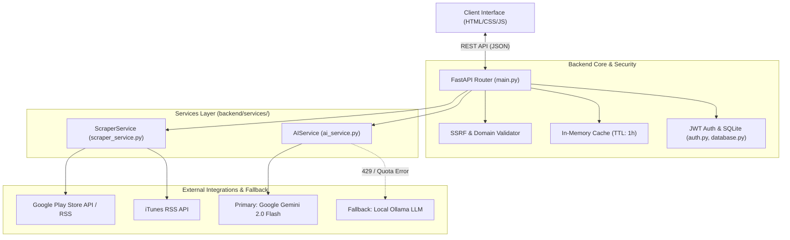
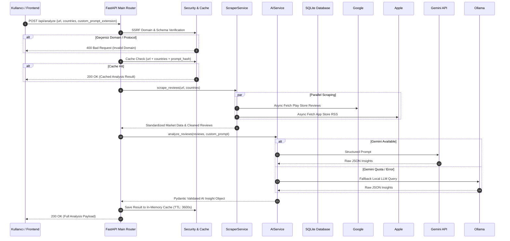

# REVIXA v2.0 — SİSTEM MİMARİSİ VE VERİ AKIŞ REHBERİ

## 1. Mimari Genel Bakış

REVIXA v2.0, mobil uygulama mağazalarından (Google Play Store ve Apple App Store) kullanıcı yorumlarını ve pazarlama metadatalarını toplayan, AI destekli duygu (sentiment), terk etme riski (churn risk) ve stratejik rakip analizi gerçekleştiren bir **Pazar Zekası Otomasyon Platformu**dur.

Sistem, Fast-API tabanlı modüler servis mimarisi, SQLite kalıcılık katmanı, çift kademeli LLM (Gemini 2.0 Flash + Ollama Fallback) yapısı ve Pure Black & White minimalist frontend arayüzünden oluşur.



---

## 2. Derinlemesine Bileşen Mimarisi

### 2.1 Services Katmanı (`backend/services/`)

#### 1. `ScraperService` (`scraper_service.py`)
- **Platform Algılama**: URL desenlerine göre `google` (Play Store), `apple` (App Store) veya `both` modlarını dinamik tespit eder.
- **Çoklu Ülke Paralel Scraping**: `TR`, `US`, `DE`, `GB` vb. hedef ülkelerden async HTTP havuzu ile yorum ve metadata toplar.
- **Ağırlıklı Ortalama Metrik Hesabı**: Çift mağaza isteklerinde (`Platform.BOTH`), uygulama puanını ve yıldız dağılımını indirme/yorum sayılarına oranla weighted average formülü ile birleştirir:
  $$\text{Weighted Rating} = \frac{\sum (R_i \times N_i)}{\sum N_i}$$
- **Coğrafi İzole Tekleştirme**: Farklı ülkelerden gelen aynı içerikli yorumların elenmesini önlemek için benzersizlik anahtarı olarak `(country, review_content)` çifti kullanılır.

#### 2. `AIService` (`ai_service.py`)
- **LLM Cascade Engine**: Öncelikli olarak Google Gemini API (`gemini-2.0-flash`) istemcisini çalıştırır. Kota aşımı (429) veya network timeout durumunda kesintisiz biçimde yerel Ollama modeline (`llama3.2`) fallback yapar.
- **Prompt Mühendisliği**: Sistem promptu + Kullanıcı Özel Ek Prompt bileşimi ile yapılandırılmış JSON formatında analiz çıktısı üretir.
- **Kural Tabanlı Duygu Yedeklemesi**: LLM servislerinin tamamen erişilemez olması durumunda sözlük tabanlı duygu dağılımı (`calculate_sentiment_distribution`) ile sistem çalışmaya devam eder.

---

## 3. Uçtan Uca Veri Akış Şeması (Sequence Diagram)



---

## 4. API Şemaları ve Sözleşmeleri

### 4.1 `/api/analyze` (POST)

#### Request Payload Schema:
```json
{
  "url": "https://play.google.com/store/apps/details?id=com.spotify.music",
  "countries": ["TR", "US"],
  "custom_prompt_extension": "Focus on subscription pricing complaints and UI crashes after v8.9 update."
}
```

#### Response Payload Schema (200 OK):
```json
{
  "app_name": "Spotify: Music and Podcasts",
  "developer": "Spotify AB",
  "platform": "google",
  "rating": 4.4,
  "reviews_count": 1500,
  "star_distribution": {
    "1": 120,
    "2": 80,
    "3": 150,
    "4": 350,
    "5": 800
  },
  "ai_analysis": {
    "sentiment_breakdown": {
      "positive": 65.0,
      "neutral": 15.0,
      "negative": 20.0
    },
    "churn_risk": {
      "score": 35.5,
      "level": "MEDIUM",
      "reasons": ["Recent update audio bug", "Subscription price increase"]
    },
    "version_warning": {
      "has_warning": true,
      "version": "8.9.12",
      "issues": ["App crashes on startup", "Bluetooth dropouts"]
    },
    "competitor_radar": [
      {"name": "Apple Music", "mentions": 42, "context": "Better lossless audio support"},
      {"name": "YouTube Music", "mentions": 28, "context": "Better recommendation algorithms"}
    ],
    "feature_rankings": [
      {"feature": "Offline Downloading", "sentiment": "POSITIVE", "score": 88},
      {"feature": "UI Search Layout", "sentiment": "NEGATIVE", "score": 25}
    ],
    "key_insights": ["Users praise offline play but dislike recent tab reorganization."]
  },
  "reviews_sample": [
    {
      "user": "Alex",
      "rating": 1,
      "content": "Crashes immediately after the last patch!",
      "country": "US",
      "date": "2026-09-15"
    }
  ]
}
```

### 4.2 `/health/ready` (GET)

#### Response Payload Schema:
```json
{
  "status": "ready",
  "database": "connected",
  "ai_engine": {
    "gemini": "available",
    "ollama": "fallback_ready"
  },
  "uptime_seconds": 3420
}
```

---

## 5. Güvenlik, Bellek ve Önbellek Mimarisi

- **SSRF Önleme Katmanı**: `urlparse(url).netloc` kontrol edilerek sadece `play.google.com`, `apps.apple.com` ve `itunes.apple.com` domain'lerine çıkış izni verilir. IP bazlı adresler (`127.0.0.1`, `169.254.169.254`) anında engellenir.
- **Cache Eviction**: `AnalysisCache` sınıfı 1 saatlik TTL (Time To Live) ile çalışır. Önbellek anahtarı `MD5(url + countries + prompt)` bileşimidir. Memory leak engellemesi için maks 500 kayıt saklanır (LRU mantığı).
- **Veritabanı İzolasyonu**: SQLite veritabanı `backend/revixa.db` dosyasında tutulur, kullanıcı şifreleri `passlib[bcrypt]` ile 12 turlu tuzlanarak saklanır.
