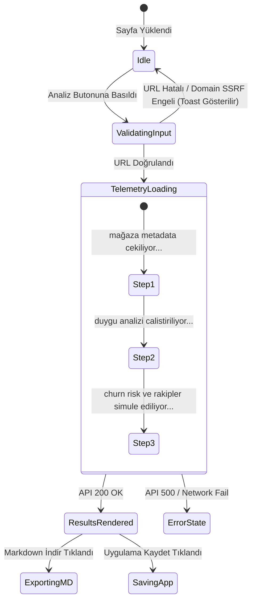

# REVIXA FRONTEND VE UI/UX TASARIM DOKÜMANI

## 1. Tasarım Felsefesi: Pure Black & White Minimalist

REVIXA ön yüzü, gereksiz renk karmaşasından arındırılmış, yüksek kontrastlı, monospace tipografi dokunuşlu ve veri odaklı bir **Pure Black & White (B&W) Dark Mode** tasarım sistemine sahiptir.

### 1.1 CSS Token ve Değişken Tablosu (`frontend/style.css`)

| CSS Değişkeni | Renk Kodu / Değer | Kullanım Alanı |
| :--- | :--- | :--- |
| `--bg-dark` | `#000000` | Ana arka plan (Pure Black) |
| `--card-bg` | `#09090b` | Kart ve container arka planı |
| `--text-main` | `#ffffff` | Birincil metin ve başlıklar |
| `--text-muted` | `#a1a1aa` | İkincil metinler ve açıklamalar |
| `--border-color` | `#27272a` | İnce minimalist kenarlıklar |
| `--accent-white` | `#ffffff` | Buton aktif durumları ve vurgular |
| `--accent-gray` | `#18181b` | Hover durumları ve rozet arka planları |
| `--font-sans` | `'Inter', sans-serif` | Gövde ve UI metinleri |
| `--font-mono` | `'JetBrains Mono', monospace` | ASCII telemetri, kod ve sayısal metrikler |

---

## 2. Arayüz Yaşam Döngüsü ve DOM Etkileşim Haritası



---

## 3. `renderResults` Render Akışı ve Bileşen Yapısı (`frontend/app.js`)

Analiz API'sinden gelen JSON verisi, `app.js` içerisindeki `renderResults()` fonksiyonu tarafından parçalanarak aşağıdaki hiyerarşide DOM'a dinamik olarak enjekte edilir:

```
[ `#results-container` ]
 ├── [ Header Card ]: Uygulama Adı, Geliştirici, Puan, Toplam Yorum, Mağaza Rozeti
 ├── [ Metric Grid ]:
 │    ├── Duygu Dağılımı (Pozitif %, Nötr %, Negatif %)
 │    └── Yıldız Dağılım Grafiği (5★ -> 1★ B&W Progress Bar'lar)
 ├── [ Insight Cards Grid ]:
 │    ├── [ Churn Risk Card ]: Churn Skoru Skalası, Risk Seviyesi Rozeti ve Nedenler
 │    └── [ Version Warning Card ]: Sürüm Uyarısı Alert Rozeti ve Bildirilen Crash/Kasma Sorunları
 ├── [ Strategic Intelligence Grid ]:
 │    ├── [ Competitor Radar ]: Rakip Bahsetmeleri ve Kullanıcı Karşılaştırmaları Tablosu
 │    └── [ Feature Rankings ]: Özellik Beğeni / Şikayet Sıralama Izgarası
 ├── [ Word Cloud & Geo Distribution ]: Yorum Kelime Bulutu + Ülke Dağılım Rozetleri
 └── [ Action Bar ]: Markdown Raporu İndirme (`exportMarkdownReport`) ve Kaydetme Butonları
```

---

## 4. Çoklu Dil Desteği (i18n Mimarisi)

Arayüz Türkçe (`TR`) ve İngilizce (`EN`) olmak üzere dinamik dil anahtarlamasına sahiptir. `app.js` içerisindeki `TRANSLATIONS` nesnesi tüm UI dizgilerini saklar.

### 4.1 i18n Sözlük Şeması Örneği
```javascript
const TRANSLATIONS = {
  tr: {
    heroTitle: "Uygulama Mağazası Yorum ve Pazar Zekası Analizi",
    analyzeBtn: "Analiz Et",
    churnTitle: "Müşteri Terk Etme (Churn) Riski",
    downloadReport: "Markdown Raporu İndir",
    versionAlert: "Kritik Güncelleme Uyarısı"
  },
  en: {
    heroTitle: "App Store & Play Store Market Intelligence",
    analyzeBtn: "Analyze",
    churnTitle: "Customer Churn Risk",
    downloadReport: "Download Markdown Report",
    versionAlert: "Critical Release Warning"
  }
};
```

Dil anahtarlama işlemi `switchLanguage(lang)` fonksiyonu ile gerçekleşir. Seçilen dil `localStorage.setItem('revixa_lang', lang)` ile bellekte tutulur.

---

## 5. Telemetri Yükleme Simülasyonu (ASCII Loading)

Analiz süresince kullanıcıya sistemin çalıştığını göstermek için monospace font ile ASCII telemetri barı gösterilir:

```
[██████████████████░░░░] 75% | Ollama LLM duygu ve churn riski hesaplıyor...
> TR store scraping complete. (150 reviews)
> US store scraping complete. (230 reviews)
> Gemini 2.0 Flash fallback active.
```

